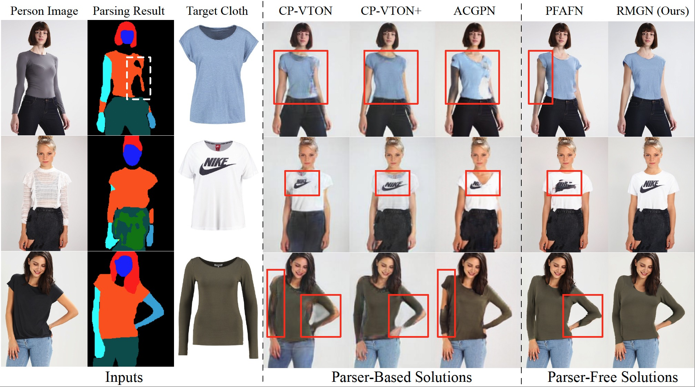

## RMGN-VITON



> **RMGN: A Regional Mask Guided Network for Parser-free Virtual Try-on**<br>
> In IJCAI-ECAI 2022(short oral).

>[[Paper]](http://arxiv.org/abs/2204.11258)
>[[Supplementary Material]](https://drive.google.com/file/d/1Io5VODelB3J8tXznATQQWlaKiR_xycg-/view?usp=sharing)

> **Abstract:** *Virtual try-on(VTON) aims at fitting target clothes to reference person images, which is widely adopted in e-commerce.Existing VTON approaches can be narrowly categorized into Parser-Based(PB) and Parser-Free(PF) by whether relying on the parser information to mask the persons' clothes and synthesize try-on images. Although abandoning parser information has improved the applicability of PF methods, the ability of detail synthesizing has also been sacrificed. As a result, the distraction from original cloth may persistin synthesized images, especially in complicated postures and high resolution applications. To address the aforementioned issue, we propose a novel PF method named Regional Mask Guided Network(RMGN). More specifically, a regional mask is proposed to explicitly fuse the features of target clothes and reference persons so that the persisted distraction can be eliminated. A posture awareness loss and a multi-level feature extractor are further proposed to handle the complicated postures and synthesize high resolution images. Extensive experiments demonstrate that our proposed RMGN outperforms both state-of-the-art PB and PF methods.Ablation studies further verify the effectiveness ofmodules in RMGN.*


## Installation

```
python>=3.6
torch>=1.8
cupy-cuda101
```

## Dataset

You can download the test dataset from the [[test dataset]](https://drive.google.com/file/d/14InQtPJ_zBEZadBN6s0Ze2iHSOheYgr-/view?usp=sharing)

## Checkpoints

You can download the checkpoints from the [[checkpoints]](https://drive.google.com/file/d/1xLXAMhbVjjl9aIQjyTXzvH5bBhzXtrep/view?usp=sharing)

## Testing

To generate virtual try-on images, run:

```
python test.py --name test_pairs --resize_or_crop scale_width --batchSize 1 --gpu_ids 0  --hr  --predmask
```

We achieves FID 9.81 on VITON test set (512x384) with the test_pairs.txt


## Citation

If you find this work useful for your research, please cite our paper:

```
@inproceedings{lin2022viton,
  title={RMGN: A Regional Mask Guided Network for Parser-free Virtual Try-on},
  author={Lin, Chao and Li, Zhao and Zhou, Sheng and Hu, Shichang and Zhang, Jialun and Luo, Linhao and Zhang, Jiarun and Huang, Longtao and He, Yuan},
  booktitle={IJCAI},
  year={2022}
}
```
